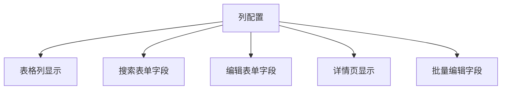
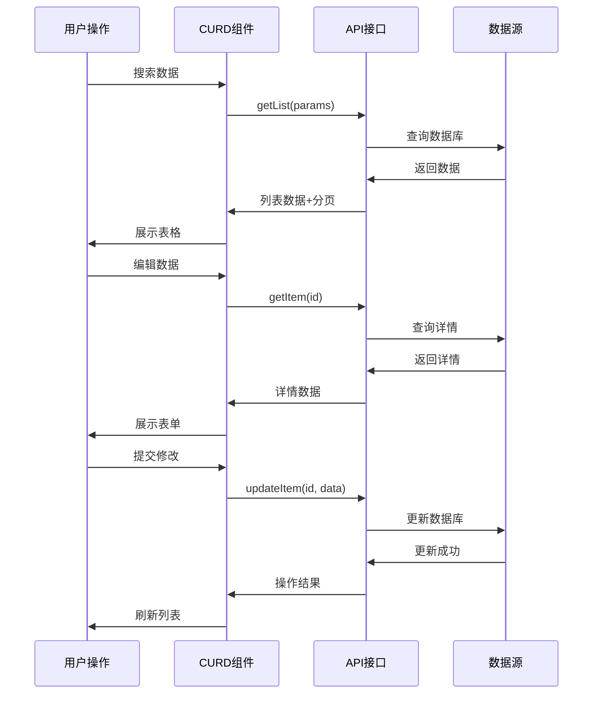
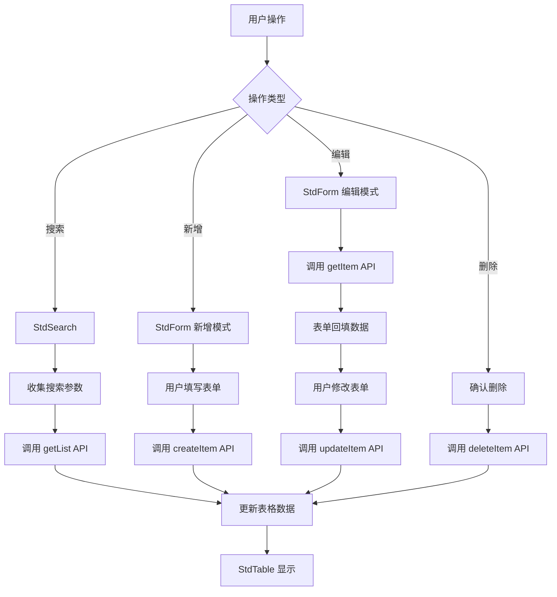

# 基础概念

在深入使用 CURD 组件库之前，让我们先理解其核心设计理念和关键概念。这些概念是整个组件库的基石，掌握它们将帮助您更高效地使用所有功能。

## 🎯 设计理念

### 统一配置，多处复用

CURD 的核心理念是**一处定义，处处使用**。通过一个列配置对象，同时控制：



这避免了传统开发中表格、表单、搜索分别配置的重复工作。

### API 驱动的数据管理



## 📋 核心概念详解

### 列配置 (StdTableColumn)

列配置是 CURD 最重要的概念，它是一个统一的配置对象，描述了数据的完整生命周期：

```ts
interface StdTableColumn {
  // 基础配置
  title: string                    // 列标题
  dataIndex: string | string[]     // 数据字段路径
  
  // 表格配置  
  width?: number                   // 列宽
  fixed?: 'left' | 'right'        // 固定列
  sorter?: boolean | Function      // 排序
  
  // 搜索配置
  search?: {
    control: FormControlType       // 搜索控件类型
    label?: string                 // 搜索标签
    options?: Array<{label: string, value: any}> // 选项数据
    placeholder?: string           // 占位符
    // ...更多搜索配置
  }
  
  // 表单配置
  form?: {
    control: FormControlType       // 表单控件类型
    required?: boolean             // 是否必填
    rules?: ValidationRule[]       // 验证规则
    defaultValue?: any             // 默认值
    disabled?: boolean             // 是否禁用
    // ...更多表单配置
  }
  
  // 显示配置
  customRender?: (args: RenderArgs) => VNode | string  // 自定义渲染
  hide?: boolean                   // 是否隐藏列
}
```

#### 🌟 统一配置示例

```ts
const columns: StdTableColumn[] = [
  {
    title: '用户状态',
    dataIndex: 'status',
    
    // 📊 表格中显示：使用自定义渲染显示状态文本
    customRender: ({ value }) => {
      return value === 1 ? '✅ 启用' : '❌ 禁用'
    },
    
    // 🔍 搜索中使用：下拉选择
    search: {
      control: 'select',
      options: [
        { label: '启用', value: 1 },
        { label: '禁用', value: 0 }
      ]
    },
    
    // 📝 表单中使用：开关控件
    form: {
      control: 'switch',
      required: true,
      defaultValue: 1,
      checkedChildren: '启用',
      unCheckedChildren: '禁用'
    }
  }
]
```

### 表单控件 (FormControl)

表单控件定义了数据如何输入和编辑。CURD 提供了丰富的控件类型：

```ts
// 基础输入控件
type BasicControls = 
  | 'input'        // 文本输入框
  | 'password'     // 密码输入框  
  | 'textarea'     // 多行文本
  | 'inputNumber'  // 数字输入框

// 选择控件
type SelectControls =
  | 'select'       // 下拉选择
  | 'radioGroup'   // 单选按钮组
  | 'checkboxGroup'// 多选框组
  | 'cascader'     // 级联选择
  | 'selector'     // 高级选择器

// 日期时间控件
type DateControls =
  | 'date' | 'datetime' | 'time'
  | 'year' | 'month' | 'week'
  | 'dateRange' | 'datetimeRange' | 'timeRange'

// 高级控件
type AdvancedControls = 
  | 'upload'       // 文件上传
  | 'switch'       // 开关
  | 'slider'       // 滑块
  | 'rate'         // 评分
```

#### 🎛️ 控件配置示例

```ts
const columns: StdTableColumn[] = [
  {
    title: '头像',
    dataIndex: 'avatar',
    form: {
      control: 'upload',
      accept: 'image/*',
      maxCount: 1,
      action: '/api/upload'
    }
  },
  {
    title: '出生日期',  
    dataIndex: 'birthDate',
    form: {
      control: 'date',
      format: 'YYYY-MM-DD',
      disabledDate: (date) => date.isAfter(dayjs())  // 不能选择未来日期
    }
  },
  {
    title: '兴趣爱好',
    dataIndex: 'hobbies', 
    form: {
      control: 'checkboxGroup',
      options: [
        { label: '阅读', value: 'reading' },
        { label: '运动', value: 'sports' },
        { label: '旅行', value: 'travel' }
      ]
    }
  }
]
```

### API 接口 (StdApi)

CURD 组件通过标准化的 API 接口与后端交互。接口定义遵循 RESTful 规范：

```ts
interface StdApi {
  // 📋 获取列表数据 (支持搜索、分页、排序)
  getList: (params: {
    // 搜索参数
    [key: string]: any
    
    // 分页参数  
    current?: number     // 当前页码
    pageSize?: number    // 每页条数
    
    // 排序参数
    sorter?: {
      field: string      // 排序字段
      order: 'ascend' | 'descend'  // 排序方向  
    }
  }) => Promise<{
    data: any[]          // 数据列表
    pagination: {
      total: number      // 总记录数
      current: number    // 当前页码
      pageSize: number   // 每页条数
    }
  }>

  // 📄 获取单条数据详情
  getItem: (id: string | number) => Promise<any>

  // ➕ 创建新数据
  createItem: (data: Record<string, any>) => Promise<any>

  // ✏️ 更新现有数据
  updateItem: (id: string | number, data: Record<string, any>) => Promise<any>

  // 🗑️ 删除数据
  deleteItem: (id: string | number) => Promise<any>
}
```

#### 🔌 API 使用示例

使用 `@uozi-admin/request` 快速创建 API：

```ts
import { useCurdApi } from '@uozi-admin/request'

// 自动生成标准的 CRUD API
const userApi = useCurdApi('/api/users')

// 等同于：
const userApi = {
  getList: (params) => request.get('/api/users', { params }),
  getItem: (id) => request.get(`/api/users/${id}`),
  createItem: (data) => request.post('/api/users', data),
  updateItem: (id, data) => request.put(`/api/users/${id}`, data),
  deleteItem: (id) => request.delete(`/api/users/${id}`)
}
```

## 🏗️ 组件架构

CURD 采用组件化设计，你可以选择一站式方案或单独使用各个组件：

### 组件层级结构

```
🏢 StdCurd (一站式解决方案)
├── 🔍 StdSearch (搜索表单)
├── 📊 StdTable (数据表格)
├── 📝 StdForm (编辑表单) 
├── 📄 StdDetail (详情页面)
└── 📃 StdPagination (分页组件)
```

### 使用方式对比

| 使用方式 | 适用场景 | 优势 | 劣势 |
|---------|---------|------|------|
| **StdCurd 一站式** | 标准 CRUD 页面 | 开箱即用，代码简洁 | 定制化有限 |
| **组合使用** | 复杂业务场景 | 高度灵活，完全控制 | 代码量较多 |

#### 🎯 一站式使用

```vue
<template>
  <StdCurd 
    title="用户管理"
    :api="userApi"
    :columns="columns"
  />
</template>
```

#### 🔧 组合使用

```vue
<template>
  <div>
    <StdSearch :columns="columns" @search="handleSearch" />
    <StdTable :api="userApi" :columns="columns" :search-params="searchParams" />
  </div>
</template>
```

## 🔄 数据流转

理解数据在 CURD 组件中的流转过程：



### 状态管理

CURD 组件内部自动管理以下状态，无需手动维护：

| 状态类型 | 说明 | 自动管理 |
|---------|------|---------|
| **列表数据** | 表格显示的数据 | ✅ |
| **搜索参数** | 当前搜索条件 | ✅ |
| **分页信息** | 当前页码、每页条数 | ✅ |
| **排序参数** | 排序字段和方向 | ✅ |
| **加载状态** | 数据加载中状态 | ✅ |
| **选中行** | 表格选中的行数据 | ✅ |
| **表单数据** | 表单的当前值 | ✅ |

## 🎨 定制化能力

### 渲染定制

```ts
const columns = [
  {
    title: '状态',
    dataIndex: 'status',
    customRender: ({ value, record }) => {
      // 自定义渲染逻辑
      return h('span', { 
        class: value === 1 ? 'text-green' : 'text-red' 
      }, value === 1 ? '启用' : '禁用')
    }
  }
]
```

### 表单定制

```ts
const columns = [
  {
    title: '复杂字段',
    dataIndex: 'complex',
    form: {
      // 自定义 Vue 组件
      control: MyCustomComponent,
      // 或自定义渲染函数
      control: (formData, column, config) => {
        return h(MyComponent, { 
          modelValue: formData.complex,
          'onUpdate:modelValue': (val) => formData.complex = val
        })
      }
    }
  }
]
```

## 🚀 下一步学习

现在您已经理解了 CURD 的核心概念，可以深入学习：

### 📚 核心功能
- **[列配置详解](/zh/curd/core/column)** - 掌握强大的列配置选项
- **[表单配置](/zh/curd/core/form)** - 学习表单验证和高级配置  
- **[搜索配置](/zh/curd/core/search)** - 了解搜索功能的完整用法

### 🧩 组件使用
- **[StdCurd 组件](/zh/curd/components/std-curd)** - 一站式解决方案的完整 API
- **[StdTable 组件](/zh/curd/components/std-table)** - 数据表格的高级用法
- **[StdForm 组件](/zh/curd/components/std-form)** - 表单组件的详细配置

### ⚡ 进阶主题  
- **[表单联动](/zh/curd/advance/form-linkage)** - 实现字段间的交互逻辑
- **[自定义渲染](/zh/curd/advance/custom-render)** - 个性化显示和交互
- **[全局配置](/zh/curd/advance/global-config)** - 配置全局默认行为

准备好深入探索了吗？选择你感兴趣的主题继续学习！🎓
