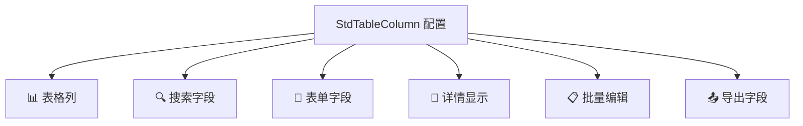

# 列配置详解

列配置（StdTableColumn）是 CURD 组件库的灵魂，它是连接数据和视图的桥梁。通过一个统一的配置对象，同时定义数据在表格、搜索、表单、详情页等不同场景下的展示和行为。

## 🎯 核心价值

### 一处定义，处处使用

传统开发中，你可能需要分别配置：
- 表格列定义 
- 搜索表单字段
- 编辑表单字段
- 详情页显示

使用 StdTableColumn，只需要一个配置对象：



:::info 📝 类型定义
`StdTableColumn` 继承自 Ant Design Vue 的 `TableColumnType`，保持了完整的表格功能，同时扩展了 CURD 特有的配置选项。
:::

## 📋 完整类型定义

```ts
export interface StdTableColumn<T = any> extends Omit<TableColumnType, 'customRender'> {
  // 🏷️ 基础信息
  title: string | (() => string)           // 列标题
  dataIndex: string | string[]             // 数据字段路径 (支持嵌套: ['user', 'profile', 'name'])
  
  // 📊 表格显示
  width?: number                           // 列宽
  fixed?: 'left' | 'right'                // 固定列
  align?: 'left' | 'center' | 'right'     // 对齐方式
  sorter?: boolean | Function              // 排序功能
  
  // 🔍 搜索配置  
  search?: boolean | StdFormConfig         // 搜索表单配置
  
  // 📝 表单配置
  form?: StdFormConfig                     // 表单控件配置 (新增/编辑时使用)
  edit?: StdFormConfig                     // 编辑专用配置 (已弃用，建议使用 form)
  
  // 🎨 自定义渲染
  customRender?: CustomRenderFn<T>         // 表格单元格自定义渲染
  customHeaderRender?: CustomHeaderRenderFn // 表头自定义渲染
  
  // 👁️ 显示控制
  hide?: boolean                           // 是否完全隐藏此列
  hiddenInTable?: boolean                  // 在表格中隐藏
  hiddenInSearch?: boolean                 // 在搜索表单中隐藏  
  hiddenInForm?: boolean                   // 在表单中隐藏
  hiddenInDetail?: boolean                 // 在详情页中隐藏
  hiddenInExport?: boolean                 // 在导出中隐藏
  
  // 🔧 高级功能
  pure?: boolean                           // 是否为纯展示列 (不参与任何交互)
  batchEdit?: boolean                      // 是否支持批量编辑
  
  // 💼 业务扩展
  [key: string]: any                       // 支持任意扩展属性
}
```

### 🌟 字段路径支持

`dataIndex` 支持多种格式，适应不同的数据结构：

```ts
// 简单字段
dataIndex: 'username'
// 对应数据: { username: 'alice' }

// 嵌套对象  
dataIndex: ['user', 'profile', 'name']
// 对应数据: { user: { profile: { name: 'Alice' } } }

// 数组索引
dataIndex: ['tags', 0, 'name']
// 对应数据: { tags: [{ name: 'VIP' }] }
```

## 🔍 搜索配置详解

搜索功能让用户能够快速筛选数据，通过 `search` 字段配置：

### 基础用法

```ts
const columns: StdTableColumn[] = [
  {
    title: '用户名',
    dataIndex: 'username',
    
    // ✅ 最简配置：继承表单配置
    search: true,
    form: {
      control: 'input',
      placeholder: '请输入用户名'
    }
  },
  
  {
    title: '状态',
    dataIndex: 'status',
    
    // ✅ 独立搜索配置：不同于表单的搜索逻辑
    search: {
      control: 'select',
      options: [
        { label: '全部', value: '' },    // 搜索中通常需要"全部"选项
        { label: '启用', value: 1 },
        { label: '禁用', value: 0 }
      ],
      placeholder: '请选择状态'
    },
    
    // 表单中的配置可能不同
    form: {
      control: 'switch',
      checkedChildren: '启用',
      unCheckedChildren: '禁用'
    }
  }
]
```

### 搜索控件类型

| 控件类型 | 适用场景 | 示例 |
|---------|---------|------|
| `input` | 文本模糊搜索 | 用户名、邮箱、备注 |
| `select` | 状态、分类筛选 | 用户状态、订单状态 |
| `date` | 单个日期筛选 | 创建日期、生日 |
| `dateRange` | 日期范围筛选 | 注册时间范围 |
| `inputNumber` | 数值范围搜索 | 年龄、价格 |
| `cascader` | 层级数据筛选 | 地区、部门 |

### 搜索配置示例

<demo vue="../demos/curd/search/advanced-search.vue" title="高级搜索示例" description="展示各种搜索控件的使用方法和效果"></demo>

## 📝 表单配置详解

表单配置定义了数据如何在新增/编辑表单中展示和验证。推荐使用 `form` 字段（`edit` 已弃用）：

### 基础表单配置

```ts
const columns: StdTableColumn[] = [
  {
    title: '用户名',
    dataIndex: 'username',
    form: {
      control: 'input',           // 表单控件类型
      required: true,             // 是否必填
      label: '用户名',            // 表单标签（不填则使用 title）
      placeholder: '请输入用户名',
      rules: [                    // 验证规则
        { required: true, message: '请输入用户名' },
        { min: 3, max: 20, message: '用户名长度在 3 到 20 个字符' }
      ]
    }
  }
]
```

### 表单控件配置

<demo vue="../demos/curd/form/form-controls.vue" title="表单控件示例" description="展示各种表单控件的配置和使用效果"></demo>

### 表单验证规则

支持 Ant Design Vue 的所有验证规则：

```ts
{
  title: '手机号',
  dataIndex: 'phone',
  form: {
    control: 'input',
    rules: [
      { required: true, message: '请输入手机号' },
      { pattern: /^1[3-9]\d{9}$/, message: '请输入正确的手机号' },
      { 
        validator: async (rule, value) => {
          if (value && await checkPhoneExists(value)) {
            throw new Error('手机号已存在')
          }
        }
      }
    ]
  }
}
```

## 🎨 自定义渲染

自定义渲染让你能够完全控制数据在表格中的显示方式：

### 渲染函数参数

```ts
interface CustomRenderArgs {
  value: any        // 当前字段值
  text: any         // 格式化后的文本 (通常等于 value)
  record: any       // 当前行数据
  index: number     // 行索引
  column: StdTableColumn  // 列配置
}

type CustomRenderFn = (args: CustomRenderArgs) => VNode | JSX.Element | string
```

### 渲染示例

<demo vue="../demos/curd/table/custom-render.vue" title="自定义渲染示例" description="演示各种自定义渲染的效果和用法"></demo>

### JSX 语法 (可选)

如果你的项目支持 JSX，也可以使用 JSX 语法：

```tsx
{
  title: '用户信息',
  dataIndex: 'user',
  customRender: ({ record }) => (
    <div class="user-info">
      <Avatar src={record.avatar} size={24} />
      <div class="user-details">
        <div class="username">{record.username}</div>
        <div class="email">{record.email}</div>
      </div>
    </div>
  )
}

## 显示控制

控制列在不同场景下的显示:

```ts
{
  title: '备注',
  dataIndex: 'remark',
  // 在表格中隐藏
  hiddenInTable: true,
  // 在搜索表单中隐藏
  hiddenInSearch: true,
  // 在编辑表单中隐藏
  hiddenInForm: true,
  // 在详情页中隐藏
  hiddenInDetail: true
}
```

## 自定义布局

```ts
{
  // ...
  col: {
    // 配置同 ant-design-vue 的 Col 组件属性
    span: 12
  }
}
```