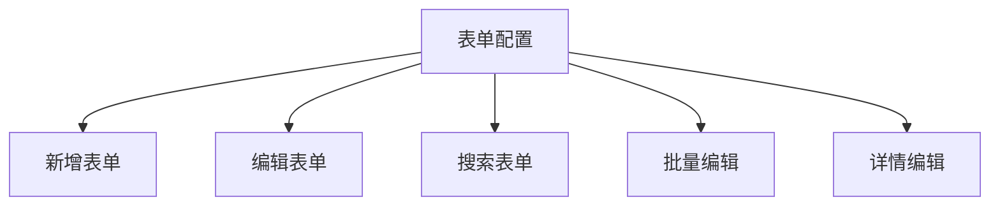

# 表单配置详解

表单配置是 CURD 组件中最重要的功能之一，它定义了数据如何在新增、编辑表单中展示和验证。通过灵活的配置选项，可以快速构建功能强大、用户体验优秀的表单界面。

## 🎯 核心优势

### 统一配置，多场景复用

一个表单配置可以同时用于：
- **新增表单** - 创建新记录
- **编辑表单** - 修改现有记录  
- **搜索表单** - 数据筛选（通过 `search` 配置）
- **批量编辑** - 批量修改多条记录



### 声明式配置

通过简单的 JSON 配置，无需编写复杂的表单逻辑：

```ts
// 复杂的用户信息表单，仅需简单配置
const userFormConfig = {
  control: 'input',
  required: true,
  rules: [{ min: 3, message: '至少3个字符' }],
  placeholder: '请输入用户名'
}
```

## 📋 完整类型定义

```ts
interface StdFormConfig {
  // 🎛️ 表单控件
  control: FormControlType                 // 控件类型，如 'input', 'select', 'date' 等
  
  // 📝 表单项属性
  label?: string                           // 表单标签（不填则使用列的 title）
  required?: boolean                       // 是否必填
  disabled?: boolean                       // 是否禁用
  rules?: ValidationRule[]                 // 验证规则数组
  defaultValue?: any                       // 默认值
  
  // 💡 帮助信息
  extra?: string                           // 额外的提示信息
  tooltip?: string | TooltipProps          // 帮助提示
  
  // 📐 布局控制
  col?: ColProps                           // 栅格布局配置
  order?: number                           // 字段排序
  
  // 🔗 字段联动
  dependencies?: string[]                  // 依赖的其他字段
  onChange?: (value, formData, deps) => void  // 联动处理函数
  
  // 🎨 控件特有属性
  [controlName]?: ControlProps             // 如 input?: InputProps
  
  // 💼 扩展属性
  [key: string]: any                       // 支持任意扩展
}
```

### 🎛️ 表单控件类型

CURD 提供了丰富的内置控件类型：

| 控件类型 | 说明 | 适用场景 |
|---------|------|---------|
| **基础输入** | | |
| `input` | 单行文本输入 | 姓名、标题、描述等 |
| `password` | 密码输入 | 密码字段 |
| `textarea` | 多行文本 | 详细描述、备注等 |
| `inputNumber` | 数字输入 | 价格、数量、年龄等 |
| **选择控件** | | |
| `select` | 下拉选择 | 状态、分类、部门等 |
| `radioGroup` | 单选按钮组 | 性别、类型等 |
| `checkboxGroup` | 多选框组 | 兴趣爱好、权限等 |
| `cascader` | 级联选择 | 地区、组织架构等 |
| **日期时间** | | |
| `date` | 日期选择 | 生日、创建日期等 |
| `datetime` | 日期时间选择 | 预约时间、截止时间等 |
| `time` | 时间选择 | 营业时间、提醒时间等 |
| `dateRange` | 日期范围 | 活动时间、统计区间等 |
| **高级控件** | | |
| `upload` | 文件上传 | 头像、文档、图片等 |
| `switch` | 开关 | 启用状态、功能开关等 |
| `slider` | 滑块 | 评分、进度、范围等 |
| `rate` | 评分 | 满意度、星级等 |

### 🌟 控件配置示例

每个控件都有其专用的配置选项：

```ts
const columns: StdTableColumn[] = [
  // 📝 文本输入控件
  {
    title: '用户名',
    dataIndex: 'username',
    form: {
      control: 'input',
      required: true,
      placeholder: '请输入3-20个字符',
      maxLength: 20,
      showCount: true,
      rules: [
        { required: true, message: '请输入用户名' },
        { min: 3, max: 20, message: '长度在3-20个字符' }
      ]
    }
  },
  
  // 📊 下拉选择控件
  {
    title: '用户角色',
    dataIndex: 'role',
    form: {
      control: 'select',
      required: true,
      placeholder: '请选择用户角色',
      options: [
        { label: '管理员', value: 'admin', disabled: false },
        { label: '编辑者', value: 'editor' },
        { label: '查看者', value: 'viewer' }
      ],
      allowClear: true,
      showSearch: true
    }
  },
  
  // 📅 日期选择控件
  {
    title: '入职日期',
    dataIndex: 'join_date',
    form: {
      control: 'date',
      required: true,
      format: 'YYYY-MM-DD',
      disabledDate: (current) => {
        // 不能选择未来日期
        return current && current.isAfter(dayjs().endOf('day'))
      }
    }
  }
]
```

## 🔧 表单验证系统

CURD 提供了强大而灵活的表单验证系统，支持多种验证规则：

### 内置验证规则

```ts
interface ValidationRule {
  // 基础验证
  required?: boolean                       // 必填验证
  message?: string                         // 错误信息
  
  // 类型验证
  type?: 'string' | 'number' | 'boolean' | 'array' | 'object' | 'email' | 'url' | 'date'
  
  // 长度验证
  len?: number                            // 精确长度
  min?: number                            // 最小长度/值
  max?: number                            // 最大长度/值
  
  // 格式验证
  pattern?: RegExp                        // 正则表达式
  
  // 自定义验证
  validator?: (rule, value) => Promise<void> | void
  
  // 验证时机
  trigger?: 'blur' | 'change' | ['blur', 'change']
}
```

### 动态验证规则

根据其他字段的值动态调整验证规则：

```ts
{
  title: '确认密码',
  dataIndex: 'confirmPassword',
  form: {
    control: 'password',
    dependencies: ['password'],
    rules: [
      { required: true, message: '请确认密码' },
      {
        validator: async (rule, value, formData) => {
          if (!value) return
          
          if (value !== formData.password) {
            throw new Error('两次输入的密码不一致')
          }
        }
      }
    ]
  }
}
```

## 🌐 远程数据加载

CURD 支持从后端 API 动态加载表单选项数据，特别适用于选择类控件：

### 基础远程数据配置

```ts
interface RemoteConfig {
  api: () => Promise<any>              // API 请求函数
  valueKey?: string                    // 值字段名，默认 'value'
  labelKey?: string                    // 标签字段名，默认 'label'
  transform?: (data: any[]) => any[]   // 数据转换函数
  cache?: boolean                      // 是否缓存结果，默认 true
}
```

### 实际应用示例

<demo vue="../demos/curd/form-controls/select-demo.vue" title="远程数据选择器" description="展示如何从API加载选择器选项数据"></demo>

### 数据转换和缓存

```ts
{
  title: '商品分类',
  dataIndex: 'category_id',
  form: {
    control: 'select',
    api: async () => {
      const response = await fetch('/api/categories')
      return response.json()
    },
    
    // 数据转换函数
    transform: (categories) => {
      return categories
        .filter(cat => cat.status === 'active')  // 只显示启用的分类
        .map(cat => ({
          label: `${cat.name} (${cat.product_count} 个商品)`,
          value: cat.id,
          disabled: cat.product_count === 0  // 没有商品的分类禁用
        }))
    },
    
    // 启用缓存，避免重复请求
    cache: true
  }
}

## 🔗 字段联动系统

字段联动是表单的高级特性，允许一个字段的变化自动影响其他字段。CURD 提供了强大而灵活的联动机制：

### 联动配置接口

```ts
interface FormLinkage {
  dependencies?: string[]                    // 依赖的字段名数组
  onChange?: (                              // 联动处理函数
    value: any,                             // 当前字段值
    formData: Record<string, any>,          // 完整表单数据
    dependencies: Record<string, any>       // 依赖字段的值集合
  ) => void
}
```

### 联动应用场景

<demo vue="../demos/curd/advanced/form-linkage.vue" title="表单联动完整示例" description="演示各种表单联动场景的实际应用"></demo>

#### 🆔 身份证信息自动提取

```ts
const columns: StdTableColumn[] = [
  {
    title: '身份证号',
    dataIndex: 'id_card',
    form: {
      control: 'input',
      required: true,
      pattern: /^\d{17}[\dXx]$/,
      placeholder: '请输入18位身份证号'
    }
  },
  {
    title: '出生日期',
    dataIndex: 'birth_date',
    form: {
      control: 'date',
      disabled: true,  // 自动填充，不可编辑
      dependencies: ['id_card'],
      onChange: (value, formData, deps) => {
        const idCard = deps.id_card
        if (idCard && /^\d{17}[\dXx]$/.test(idCard)) {
          // 提取出生日期 (位置6-13)
          const birthStr = idCard.substring(6, 14)
          const year = birthStr.substring(0, 4)
          const month = birthStr.substring(4, 6)
          const day = birthStr.substring(6, 8)
          
          const birthDate = `${year}-${month}-${day}`
          set(formData, 'birth_date', birthDate)
          
          // 同时提取性别信息
          const genderCode = parseInt(idCard.substring(16, 17))
          const gender = genderCode % 2 === 0 ? 'female' : 'male'
          set(formData, 'gender', gender)
          
          // 计算年龄
          const age = dayjs().diff(dayjs(birthDate), 'year')
          set(formData, 'age', age)
        }
      }
    }
  },
  {
    title: '性别',
    dataIndex: 'gender', 
    form: {
      control: 'radioGroup',
      disabled: true,
      options: [
        { label: '男', value: 'male' },
        { label: '女', value: 'female' }
      ]
    }
  },
  {
    title: '年龄',
    dataIndex: 'age',
    form: {
      control: 'inputNumber',
      disabled: true,
      min: 0,
      max: 150
    }
  }
]
```

#### 🏢 级联选择 (省市区)

```ts
const columns: StdTableColumn[] = [
  {
    title: '省份',
    dataIndex: 'province',
    form: {
      control: 'select',
      placeholder: '请选择省份',
      api: async () => {
        const response = await fetch('/api/provinces')
        return response.json()
      }
    }
  },
  {
    title: '城市',
    dataIndex: 'city',
    form: {
      control: 'select',
      placeholder: '请先选择省份',
      dependencies: ['province'],
      onChange: async (value, formData, deps) => {
        const province = deps.province
        if (province) {
          // 加载对应省份的城市列表
          const response = await fetch(`/api/cities?province=${province}`)
          const cities = await response.json()
          
          // 更新城市选项（这里需要结合组件的响应式更新机制）
          // 实际使用中，可能需要通过 ref 或状态管理更新选项
          
          // 清空当前选择
          set(formData, 'city', undefined)
          set(formData, 'district', undefined)
        }
      }
    }
  },
  {
    title: '区县',
    dataIndex: 'district',
    form: {
      control: 'select',
      placeholder: '请先选择城市',
      dependencies: ['city'],
      onChange: async (value, formData, deps) => {
        const city = deps.city
        if (city) {
          const response = await fetch(`/api/districts?city=${city}`)
          const districts = await response.json()
          // 更新区县选项...
        }
      }
    }
  }
]
```

#### 💰 价格计算联动

```ts
const columns: StdTableColumn[] = [
  {
    title: '商品',
    dataIndex: 'product_id',
    form: {
      control: 'select',
      placeholder: '请选择商品',
      api: async () => {
        const response = await fetch('/api/products')
        return response.json()
      }
    }
  },
  {
    title: '单价',
    dataIndex: 'unit_price',
    form: {
      control: 'inputNumber',
      disabled: true,
      precision: 2,
      dependencies: ['product_id'],
      onChange: async (value, formData, deps) => {
        const productId = deps.product_id
        if (productId) {
          // 根据商品获取价格
          const response = await fetch(`/api/products/${productId}`)
          const product = await response.json()
          
          set(formData, 'unit_price', product.price)
          
          // 如果数量已填，同时更新总价
          const quantity = formData.quantity
          if (quantity) {
            set(formData, 'total_price', product.price * quantity)
          }
        }
      }
    }
  },
  {
    title: '数量',
    dataIndex: 'quantity',
    form: {
      control: 'inputNumber',
      min: 1,
      dependencies: ['unit_price'],
      onChange: (value, formData, deps) => {
        const unitPrice = deps.unit_price
        if (unitPrice && value) {
          const totalPrice = (unitPrice * value).toFixed(2)
          set(formData, 'total_price', parseFloat(totalPrice))
        }
      }
    }
  },
  {
    title: '总价',
    dataIndex: 'total_price',
    form: {
      control: 'inputNumber',
      disabled: true,
      precision: 2
    }
  }
]
```

#### 📋 条件显示/隐藏

```ts
const columns: StdTableColumn[] = [
  {
    title: '用户类型',
    dataIndex: 'user_type',
    form: {
      control: 'radioGroup',
      options: [
        { label: '个人用户', value: 'individual' },
        { label: '企业用户', value: 'company' }
      ]
    }
  },
  {
    title: '身份证号',
    dataIndex: 'id_card',
    form: {
      control: 'input',
      dependencies: ['user_type'],
      onChange: (value, formData, deps) => {
        // 根据用户类型控制字段显示
        const isIndividual = deps.user_type === 'individual'
        
        // 这里可以通过控制字段的 hidden 属性实现显示/隐藏
        // 具体实现方式取决于组件的支持情况
      }
    },
    // 条件显示：只有个人用户才显示身份证号
    hidden: (formData) => formData.user_type !== 'individual'
  },
  {
    title: '营业执照号',
    dataIndex: 'business_license',
    form: {
      control: 'input'
    },
    // 条件显示：只有企业用户才显示营业执照
    hidden: (formData) => formData.user_type !== 'company'
  }
]
```

## 📐 表单布局系统

CURD 提供了灵活的表单布局系统，支持响应式栅格布局：

### 布局配置

```ts
interface FormLayoutConfig {
  col?: {
    span?: number        // 栅格占位格数 (0-24)
    offset?: number      // 栅格左侧的间隔格数
    push?: number        // 栅格向右移动格数
    pull?: number        // 栅格向左移动格数
    order?: number       // 栅格顺序
    xs?: number | object // 超小屏 (<576px)
    sm?: number | object // 小屏 (≥576px)
    md?: number | object // 中屏 (≥768px)
    lg?: number | object // 大屏 (≥992px)
    xl?: number | object // 超大屏 (≥1200px)
    xxl?: number | object // 超超大屏 (≥1600px)
  }
  order?: number         // 字段显示顺序
}
```

### 布局示例

<demo vue="../demos/curd/form-controls/other-controls.vue" title="表单布局示例" description="展示不同的表单布局方式和响应式效果"></demo>

## 🎯 完整综合示例

以下是一个包含所有特性的完整用户表单配置：

<demo vue="../demos/curd/std-form/form-linkage.vue" title="完整表单示例" description="展示包含验证、联动、布局等所有特性的综合表单"></demo>

## 📚 相关文档

- **[表单控件详解](/zh/curd/form-controls/input)** - 了解所有可用的表单控件
- **[表单联动](/zh/curd/advance/form-linkage)** - 深入学习字段联动功能  
- **[自定义表单控件](/zh/curd/advance/custom-form-control)** - 创建自定义表单控件
- **[StdForm 组件](/zh/curd/components/std-form)** - 表单组件的完整 API
