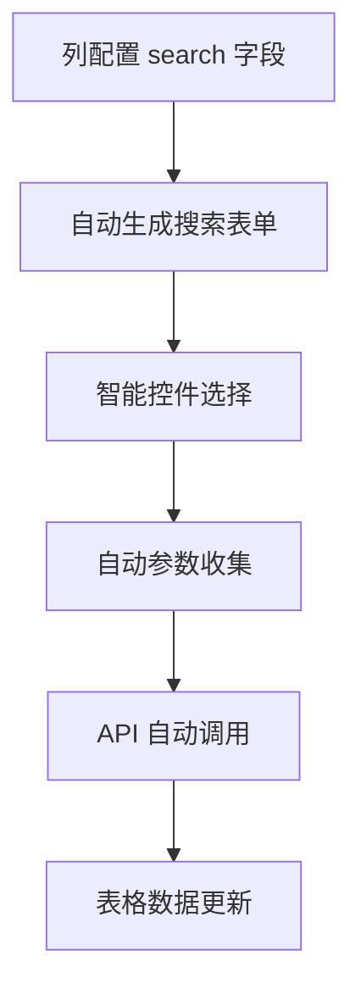

# 搜索配置详解

搜索功能是 CURD 组件库的核心特性之一，它让用户能够快速筛选和定位所需数据。通过统一的列配置，自动生成智能搜索表单，支持多种搜索控件和复杂的搜索逻辑。

## 🎯 核心价值

### 统一配置，自动生成

传统开发中，你需要：
- 单独设计搜索表单
- 手动处理搜索参数
- 维护表单状态和验证
- 实现搜索重置逻辑

使用 CURD 搜索配置：



仅需在列配置中添加 `search` 字段，即可获得完整的搜索功能。

## 📋 搜索配置类型

### 基础类型定义

```ts
interface StdTableColumn {
  search?: boolean | Partial<StdFormConfig>
  // ...
}

// 当 search 为 true 时，使用 form 配置
// 当 search 为对象时，使用独立的搜索配置
```

### 三种配置方式

| 配置方式 | 语法 | 适用场景 | 优势 |
|---------|------|---------|------|
| **继承表单配置** | `search: true` | 搜索逻辑与表单相同 | 配置简洁，避免重复 |
| **独立搜索配置** | `search: { ... }` | 搜索逻辑与表单不同 | 灵活定制，满足复杂需求 |
| **禁用搜索** | `search: false` | 不需要搜索的字段 | 精确控制 |

## 🔍 搜索控件类型

### 文本搜索控件

适用于模糊搜索场景：

```ts
const columns = [
  {
    title: '用户名',
    dataIndex: 'username',
    search: {
      type: 'input',
      input: {
        placeholder: '请输入用户名',
        allowClear: true
      }
    }
  },
  {
    title: '用户描述',
    dataIndex: 'description', 
    search: {
      type: 'textarea',
      textarea: {
        placeholder: '请输入描述关键词',
        rows: 2
      }
    }
  },
  {
    title: '年龄',
    dataIndex: 'age',
    search: {
      type: 'inputNumber',
      inputNumber: {
        placeholder: '请输入年龄',
        min: 1,
        max: 100
      }
    }
  }
]
```

### 选择搜索控件

适用于枚举值筛选：

```ts
const columns = [
  {
    title: '用户状态',
    dataIndex: 'status',
    search: {
      type: 'select',
      select: {
        options: [
          { label: '全部', value: '' },    // 搜索中的"全部"选项
          { label: '启用', value: 1 },
          { label: '禁用', value: 0 },
          { label: '待审核', value: 2 }
        ],
        placeholder: '请选择状态',
        allowClear: true
      }
    }
  },
  {
    title: '用户类型',
    dataIndex: 'userType',
    search: {
      type: 'radioGroup',
      radioGroup: {
        options: [
          { label: '普通用户', value: 'normal' },
          { label: 'VIP用户', value: 'vip' }
        ]
      }
    }
  },
  {
    title: '权限',
    dataIndex: 'permissions',
    search: {
      type: 'checkboxGroup',
      checkboxGroup: {
        options: [
          { label: '读取', value: 'read' },
          { label: '写入', value: 'write' },
          { label: '删除', value: 'delete' }
        ]
      }
    }
  }
]
```

### 日期时间搜索控件

适用于时间范围筛选：

```ts
const columns = [
  {
    title: '注册日期',
    dataIndex: 'registerDate',
    search: {
      type: 'date',
      date: {
        format: 'YYYY-MM-DD',
        placeholder: '请选择注册日期'
      }
    }
  },
  {
    title: '创建时间范围',
    dataIndex: 'createdAt',
    search: {
      type: 'dateRange',
      dateRange: {
        format: 'YYYY-MM-DD',
        placeholder: ['开始日期', '结束日期']
      }
    }
  },
  {
    title: '最后登录时间',
    dataIndex: 'lastLoginTime',
    search: {
      type: 'datetimeRange',
      datetimeRange: {
        format: 'YYYY-MM-DD HH:mm:ss',
        placeholder: ['开始时间', '结束时间']
      }
    }
  }
]
```

### 高级搜索控件

```ts
const columns = [
  {
    title: '地区',
    dataIndex: 'region',
    search: {
      type: 'cascader',
      cascader: {
        options: [
          {
            label: '广东省',
            value: 'guangdong',
            children: [
              { label: '深圳市', value: 'shenzhen' },
              { label: '广州市', value: 'guangzhou' }
            ]
          }
        ],
        placeholder: '请选择地区'
      }
    }
  },
  {
    title: '关联用户',
    dataIndex: 'relatedUserId',
    search: {
      type: 'selector',
      selector: {
        api: '/api/users',
        labelKey: 'username',
        valueKey: 'id',
        placeholder: '请选择关联用户'
      }
    }
  }
]
```

## 🔗 搜索与表单的区别

搜索配置与表单配置虽然相似，但有重要区别：

### 设计目标不同

| 方面 | 搜索表单 | 编辑表单 |
|------|---------|----------|
| **目标** | 快速筛选数据 | 准确编辑数据 |
| **验证** | 通常不需要验证 | 需要严格验证 |
| **必填** | 通常都是可选 | 可能有必填字段 |
| **默认值** | 通常为空 | 可能有预设值 |
| **选项** | 需要"全部"选项 | 不需要"全部" |

### 配置差异示例

```ts
const columns = [
  {
    title: '用户状态',
    dataIndex: 'status',
    
    // 🔍 搜索配置 - 包含"全部"选项，支持空值筛选
    search: {
      type: 'select',
      select: {
        options: [
          { label: '全部', value: '' },     // 搜索特有
          { label: '启用', value: 1 },
          { label: '禁用', value: 0 }
        ],
        allowClear: true,
        placeholder: '选择状态筛选'
      }
    },
    
    // 📝 表单配置 - 不包含"全部"，有默认值和验证
    form: {
      type: 'switch',
      switch: {
        checkedChildren: '启用',
        unCheckedChildren: '禁用'
      },
      defaultValue: 1,                    // 表单特有
      formItem: {
        required: true,                    // 表单特有
        rules: [{ required: true, message: '请选择状态' }]
      }
    }
  }
]
```

## ⚡ 搜索表单行为

### 自动搜索 vs 手动搜索

CURD 支持两种搜索触发方式：

```ts
// 方式一：自动搜索（默认）
// 用户输入后自动触发搜索，无需点击搜索按钮
<StdSearch 
  :columns="columns"
  v-model:data="searchParams"
/>

// 方式二：手动搜索
// 显示搜索按钮，用户点击后触发搜索
<StdSearch 
  :columns="columns"
  v-model:data="searchParams"
  :show-search-btn="true"
/>
```

### 搜索表单配置

```ts
interface StdSearchProps {
  columns: StdTableColumn[]           // 列配置
  data: Record<string, any>           // 搜索参数
  hideResetBtn?: boolean              // 隐藏重置按钮
  showSearchBtn?: boolean             // 显示搜索按钮
  maxVisibleItems?: number            // 最大显示项数（默认6）
}
```

### 折叠与展开

当搜索字段超过 `maxVisibleItems`（默认6个）时，自动显示展开/折叠功能：

```vue
<template>
  <StdSearch 
    :columns="columns"
    v-model:data="searchParams"
    :max-visible-items="4"  
  />
</template>
```

## 🌐 远程数据搜索

对于需要从服务端获取选项的搜索字段：

```ts
const columns = [
  {
    title: '所属部门',
    dataIndex: 'departmentId',
    search: {
      type: 'select',
      select: {
        // 🔗 远程数据配置
        remote: {
          api: '/api/departments',          // API 端点
          method: 'GET',                    // 请求方法
          params: { active: true },         // 额外参数
          labelKey: 'name',                 // 显示字段
          valueKey: 'id',                   // 值字段
          transform: (data) => {            // 数据转换
            return data.map(item => ({
              label: `${item.name}(${item.code})`,
              value: item.id
            }))
          }
        },
        placeholder: '请选择部门'
      }
    }
  },
  {
    title: '创建人',
    dataIndex: 'creatorId',
    search: {
      type: 'selector',
      selector: {
        // 🔍 高级选择器，支持搜索和分页
        api: '/api/users/search',
        labelKey: 'username',
        valueKey: 'id',
        searchable: true,                   // 支持搜索
        multiple: false,                    // 单选
        placeholder: '请选择创建人'
      }
    }
  }
]
```

## 🎨 自定义搜索控件

对于特殊需求，可以使用自定义控件：

```ts
import CustomRangeSelector from './CustomRangeSelector.vue'

const columns = [
  {
    title: '价格范围',
    dataIndex: 'priceRange',
    search: {
      type: CustomRangeSelector,          // 使用 Vue 组件
      customComponent: {
        min: 0,
        max: 10000,
        step: 100
      }
    }
  },
  {
    title: '复杂筛选',
    dataIndex: 'complexFilter',
    search: {
      // 使用渲染函数
      type: (formData, column, config) => {
        return h(MyComplexFilter, {
          modelValue: formData.complexFilter,
          'onUpdate:modelValue': (val) => {
            formData.complexFilter = val
          },
          ...config.customComponent
        })
      },
      customComponent: {
        // 传递给自定义组件的属性
        options: ['option1', 'option2']
      }
    }
  }
]
```

## 🎯 搜索表单布局

### 响应式布局

搜索表单自动适配不同屏幕尺寸：

```ts
const columns = [
  {
    title: '用户名',
    dataIndex: 'username',
    search: {
      type: 'input',
      // 🎛️ 自定义栅格布局
      col: {
        xs: 24,    // 手机全宽
        sm: 12,    // 小屏幕半宽
        md: 8,     // 中屏幕1/3宽
        lg: 6,     // 大屏幕1/4宽
        xl: 4      // 超大屏幕1/6宽
      }
    }
  }
]
```

### 表单项标签控制

```ts
const columns = [
  {
    title: '创建时间',
    dataIndex: 'createdAt',
    search: {
      type: 'dateRange',
      formItem: {
        label: '时间筛选',                // 自定义搜索标签
        hiddenLabelInSearch: false        // 是否隐藏搜索标签
      }
    }
  }
]
```

## 🔄 搜索表单联动

搜索字段间可以建立联动关系：

```ts
const columns = [
  {
    title: '省份',
    dataIndex: 'provinceId',
    search: {
      type: 'select',
      select: {
        options: provinces
      }
    }
  },
  {
    title: '城市',
    dataIndex: 'cityId',
    search: {
      type: 'select',
      select: {
        options: []  // 初始为空
      },
      // 🔗 联动配置
      dependencies: ['provinceId'],
      onChange: (value, formData, deps) => {
        // 当省份改变时，更新城市选项
        if (deps.provinceId) {
          // 重新获取城市数据
          updateCityOptions(deps.provinceId)
        } else {
          // 清空城市选项
          formData.cityId = undefined
        }
      }
    }
  }
]
```

## 📊 完整应用示例

<demo vue="../demos/curd/search/advanced-search.vue" title="高级搜索示例" description="展示各种搜索控件的使用方法和效果，包括文本搜索、选择器、日期范围、远程数据等"></demo>

### 实际业务场景

```ts
// 用户管理页面的完整搜索配置
const userColumns: StdTableColumn[] = [
  {
    title: '用户名',
    dataIndex: 'username',
    search: {
      type: 'input',
      input: {
        placeholder: '用户名/手机号/邮箱',
        allowClear: true
      }
    }
  },
  {
    title: '用户状态',
    dataIndex: 'status',
    search: {
      type: 'select',
      select: {
        options: [
          { label: '全部状态', value: '' },
          { label: '正常', value: 'active' },
          { label: '禁用', value: 'disabled' },
          { label: '待激活', value: 'pending' }
        ]
      }
    },
    customRender: ({ value }) => {
      const statusMap = {
        'active': '✅ 正常',
        'disabled': '❌ 禁用',
        'pending': '⏳ 待激活'
      }
      return statusMap[value] || value
    }
  },
  {
    title: '用户类型',
    dataIndex: 'userType',
    search: {
      type: 'checkboxGroup',
      checkboxGroup: {
        options: [
          { label: '普通用户', value: 'normal' },
          { label: 'VIP用户', value: 'vip' },
          { label: '管理员', value: 'admin' }
        ]
      }
    }
  },
  {
    title: '注册时间',
    dataIndex: 'registerTime',
    search: {
      type: 'dateRange',
      dateRange: {
        format: 'YYYY-MM-DD',
        placeholder: ['开始日期', '结束日期']
      }
    }
  },
  {
    title: '所属部门',
    dataIndex: 'departmentId',
    search: {
      type: 'selector',
      selector: {
        api: '/api/departments',
        labelKey: 'name',
        valueKey: 'id',
        searchable: true
      }
    }
  }
]
```

## 🔗 相关链接

- **[列配置详解](/zh/curd/core/column)** - 了解完整的列配置选项
- **[表单配置](/zh/curd/core/form)** - 学习表单控件和验证
- **[StdSearch 组件](/zh/curd/components/std-search)** - 搜索组件的详细API
- **[表单控件](/zh/curd/form-controls/input)** - 各类搜索控件的详细配置

搜索配置是构建高效数据管理界面的关键。通过合理配置搜索字段，可以显著提升用户的数据查找效率！🚀
