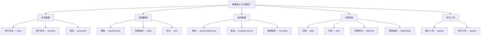

# 配置指南

全面了解 CURD 组件库的配置选项，掌握列配置、API 设置和全局配置的使用技巧。

## 📋 列配置详解

列配置是 CURD 的核心，通过统一的配置对象控制表格、搜索、表单的行为。

### 基础配置

```ts
interface StdTableColumn {
  // 🏷️ 基础信息
  title: string | (() => string)           // 列标题
  dataIndex: string | string[]             // 数据字段路径 (支持嵌套)
  
  // 📊 表格显示
  width?: number                           // 列宽
  fixed?: 'left' | 'right'                // 固定列
  align?: 'left' | 'center' | 'right'     // 对齐方式
  sorter?: boolean | Function              // 排序功能
  
  // 🔍 搜索配置  
  search?: boolean | StdFormConfig         // 搜索表单配置
  
  // 📝 表单配置
  edit?: StdFormConfig                     // 表单控件配置
  
  // 🎨 自定义渲染
  customRender?: CustomRenderFn<T>         // 表格单元格自定义渲染
  
  // 👁️ 显示控制
  hide?: boolean                           // 是否完全隐藏此列, 包括表格、搜索表单、表单、详情页
  hiddenInTable?: boolean                  // 在表格中隐藏
  hiddenInSearch?: boolean                 // 在搜索表单中隐藏  
  hiddenInEdit?: boolean                   // 在表单中隐藏
  hiddenInAdd?: boolean                   // 在新增表单中隐藏
  hiddenInDetail?: boolean                   // 在详情页中隐藏
}
```

### 数据字段路径

支持嵌套对象的字段访问：

```ts
const columns = [
  {
    title: '用户名',
    dataIndex: 'username'  // 简单字段
  },
  {
    title: '用户邮箱',
    dataIndex: ['user', 'profile', 'email']  // 嵌套字段
  },
  {
    title: '部门名称',
    dataIndex: 'department.name'  // 点号分隔也支持
  }
]
```

### 搜索配置

#### 基础搜索配置

```ts
const columns = [
  {
    title: '用户名',
    dataIndex: 'username',
    search: true  // 使用 edit 配置作为搜索配置
  },
  {
    title: '邮箱',
    dataIndex: 'email',
    search: {
      type:'input',
      placeholder: '请输入邮箱'
    }
  }
]
```

#### 独立搜索配置

搜索和表单可以使用不同的控件：

```ts
const columns = [
  {
    title: '状态',
    dataIndex: 'status',
    
    // 搜索中使用下拉选择
    search: {
      type:'select',
      select: {
        options: [
        { label: '全部', value: '' },
        { label: '启用', value: 1 },
        { label: '禁用', value: 0 }
        ],
      },
    },
    
    // 表单中使用开关
    edit: {
      type:'switch',
      switch: {
        checkedChildren: '启用',
        unCheckedChildren: '禁用',
      },
    }
  }
]
```

#### 搜索控件类型

| 控件类型 | 适用场景 | 示例 |
|---------|---------|------|
| `input` | 文本模糊搜索 | 用户名、邮箱、备注 |
| `select` | 状态、分类筛选 | 用户状态、订单状态 |
| `date` | 单个日期筛选 | 创建日期、生日 |
| `dateRange` | 日期范围筛选 | 注册时间范围 |
| `inputNumber` | 数值范围搜索 | 年龄、价格 |
| `selector` | 列表选择器 | 用户、订单 |
| `cascader` | 级联选择器 | 地区、分类 |
| `dateRange` | 日期范围筛选 | 创建日期范围 |
| `datetimeRange` | 日期时间范围筛选 | 创建日期时间范围 |
| `timeRange` | 时间范围筛选 | 创建时间范围 |
| `switch` | 开关 | 是否启用 |
| ... | ... | ... |

> **与表单控件类型一致**

### 表单配置

#### 基础表单配置

```ts
interface StdFormConfig {
  type:FormControlType                 // 控件类型
  label?: string                          // 表单标签
  required?: boolean                      // 是否必填
  disabled?: boolean                      // 是否禁用
  placeholder?: string                    // 占位符
  defaultValue?: any                      // 默认值
  rules?: ValidationRule[]                // 验证规则
  
  // 布局配置
  col?: ColProps                          // 栅格布局
  formItem?: FormItemProps                // 表单项属性
  
  // 控件特定配置
  [key: string]: any                      // 控件特定属性, key 为控件类型名称
  customComponent?: Record<string | number | symbol, any> // 自定义组件的属性
}
```

#### 表单控件类型

```ts
// 基础输入控件
type BasicControls = 
  | 'input'        // 文本输入框
  | 'password'     // 密码输入框  
  | 'textarea'     // 多行文本
  | 'inputNumber'  // 数字输入框

// 选择控件
type SelectControls =
  | 'select'       // 下拉选择
  | 'selector'     // 列表选择器
  | 'radioGroup'   // 单选按钮组
  | 'checkboxGroup'// 多选框组
  | 'cascader'     // 级联选择

// 日期时间控件
type DateControls =
  | 'date' | 'datetime' | 'time'
  | 'dateRange' | 'datetimeRange' | 'timeRange'

// 高级控件
type AdvancedControls = 
  | 'upload'       // 文件上传
  | 'switch'       // 开关
  | 'slider'       // 滑块
  | 'rate'         // 评分
```

#### 表单验证规则

```ts
const columns = [
  {
    title: '邮箱',
    dataIndex: 'email',
    edit: {
      type:'input',
      required: true,
      rules: [
        { type: 'email', message: '请输入正确的邮箱格式' },
        { min: 5, message: '邮箱长度至少5个字符' },
        { max: 50, message: '邮箱长度不能超过50个字符' }
      ]
    }
  },
  {
    title: '年龄',
    dataIndex: 'age',
    edit: {
      type:'inputNumber',
      required: true,
      rules: [
        { type: 'number', min: 18, max: 65, message: '年龄必须在18-65之间' }
      ]
    }
  }
]
```

### 自定义渲染

#### 表格单元格渲染

```ts
const columns = [
  {
    title: '状态',
    dataIndex: 'status',
    customRender: ({ value, record, index }) => {
      const statusMap = {
        1: { text: '启用', color: 'green' },
        0: { text: '禁用', color: 'red' }
      }
      const status = statusMap[value]
      return h(Tag, { color: status.color }, () => status.text)
    }
  },
  {
    title: '头像',
    dataIndex: 'avatar',
    customRender: ({ value }) => {
      return h('img', {
        src: value,
        style: 'width: 32px; height: 32px; border-radius: 50%;'
      })
    }
  }
]
```

#### JSX 语法支持

如果项目支持 JSX：

```tsx
{
  title: '用户信息',
  dataIndex: 'user',
  customRender: ({ record }) => (
    <div class="user-info">
      <Avatar src={record.avatar} size={24} />
      <div class="user-details">
        <div class="username">{record.username}</div>
        <div class="email">{record.email}</div>
      </div>
    </div>
  )
}
```

### 显示控制

控制列在不同场景下的显示：

```ts
{
  title: '备注',
  dataIndex: 'remark',
  hiddenInTable: true,     // 在表格中隐藏
  hiddenInSearch: true,    // 在搜索表单中隐藏
  hiddenInEdit: false,     // 在编辑表单中显示
  hiddenInAdd: false,     // 在新增表单中显示
  hiddenInDetail: false    // 在详情页中显示
}
```

## 🔌 API 配置

### 使用 useCurdApi

最简单的方式是使用 `@uozi-admin/request` 提供的 `useCurdApi`：

```ts
import { useCurdApi } from '@uozi-admin/request'

// 自动生成标准的 CRUD API
const userApi = useCurdApi('/api/users')

// 等同于：
const userApi = {
  getList: (params) => request.get('/api/users', { params }),
  getItem: (id) => request.get(`/api/users/${id}`),
  createItem: (data) => request.post('/api/users', data),
  updateItem: (id, data) => request.put(`/api/users/${id}`, data),
  deleteItem: (id) => request.delete(`/api/users/${id}`)
}
```

### 自定义 API 接口

如果需要自定义 API 行为：

```ts
const customApi = {
  getList: async (params) => {
    // 自定义列表查询逻辑
    const response = await fetch('/api/users?' + new URLSearchParams(params))
    const result = await response.json()
    
    return {
      data: result.items,
      pagination: {
        total: result.total,
        current: result.page,
        pageSize: result.pageSize
      }
    }
  },
  
  getItem: async (id) => {
    const response = await fetch(`/api/users/${id}`)
    return response.json()
  },
  
  createItem: async (data) => {
    const response = await fetch('/api/users', {
      method: 'POST',
      headers: { 'Content-Type': 'application/json' },
      body: JSON.stringify(data)
    })
    return response.json()
  },
  
  updateItem: async (id, data) => {
    const response = await fetch(`/api/users/${id}`, {
      method: 'PUT', 
      headers: { 'Content-Type': 'application/json' },
      body: JSON.stringify(data)
    })
    return response.json()
  },
  
  deleteItem: async (id) => {
    const response = await fetch(`/api/users/${id}`, {
      method: 'DELETE'
    })
    return response.json()
  }
}
```

## ⚙️ 全局配置

### 基础全局配置

在 `main.ts` 中配置全局选项：

```ts
import { createCurdConfig } from '@uozi-admin/curd'

app.use(createCurdConfig({
  // 自定义分页字段映射
  listApi: {
    paginationMap: {
      params: {
        current: 'page',      // 发送给后端的当前页字段名
        pageSize: 'page_size', // 发送给后端的每页条数字段名
      },
      response: {
        total: 'total',         // 后端返回的总数字段名
        current: 'current_page', // 后端返回的当前页字段名
        pageSize: 'per_page',   // 后端返回的每页条数字段名
        totalPages: 'total_pages', // 后端返回的总页数字段名
      },
    },
  },
  
  // 自定义国际化
  i18n: {
    locale: 'zh-CN',
    fallbackLocale: 'en-US',
  },
  
  // 自定义日期格式
  dateFormat: {
    date: 'YYYY-MM-DD',
    datetime: 'YYYY-MM-DD HH:mm:ss',
  },
}))
```

### 分页配置

如果后端分页格式与标准不符：

```ts
app.use(createCurdConfig({
  listApi: {
    paginationMap: {
      params: {
        current: 'page',
        pageSize: 'limit'
      },
      response: {
        total: 'count',
        current: 'page',
        pageSize: 'limit'
      }
    }
  }
}))
```

### 国际化配置

```ts
app.use(createCurdConfig({
  i18n: {
    locale: 'zh-CN',
    messages: {
      'zh-CN': {
        view: '查看',
        edit: '编辑',
        delete: '删除',
        save: '保存',
        cancel: '取消'
      },
      'en-US': {
        view: 'View',
        edit: 'Edit',
        delete: 'Delete',
        save: 'Save',
        cancel: 'Cancel'
      }
    }
  }
}))
```

### 表单默认配置

```ts
app.use(createCurdConfig({
  edit: {
    layout: 'vertical',        // 表单布局
    labelCol: { span: 6 },     // 标签列宽
    wrapperCol: { span: 18 },  // 控件列宽
    validateTrigger: 'blur'    // 验证触发时机
  },
  
  table: {
    size: 'middle',            // 表格尺寸
    bordered: true,            // 是否显示边框
    showSorterTooltip: false   // 是否显示排序提示
  }
}))
```

## 🎯 配置决策树

### 选择合适的控件



### 配置优先级

1. **组件 props** - 最高优先级
2. **列配置** - 中等优先级  
3. **全局配置** - 最低优先级

## 🚀 下一步

现在您已经掌握了配置的核心知识，可以继续学习：

- [使用示例](./examples) - 学习常见配置模式
- [表单控件](../form-controls/basic-controls) - 深入了解各种控件
- [高级特性](../advanced/customization) - 学习高级定制技巧