# 配置指南

全面了解 CURD 组件库的配置选项，掌握列配置、API 设置和全局配置的使用技巧。

## 📋 列配置详解

列配置是 CURD 的核心，通过统一的配置对象控制表格、搜索、表单的行为。

### 基础配置

```ts
interface StdTableColumn {
  // 🏷️ 基础信息
  title: string | (() => string)           // 列标题
  dataIndex: string | string[]             // 数据字段路径 (支持嵌套)
  
  // 📊 表格显示
  width?: number                           // 列宽
  fixed?: 'left' | 'right'                // 固定列
  align?: 'left' | 'center' | 'right'     // 对齐方式
  sorter?: boolean | Function              // 排序功能
  
  // 🔍 搜索配置  
  search?: boolean | StdFormConfig         // 搜索表单配置
  
  // 📝 表单配置
  edit?: StdFormConfig                     // 表单控件配置
  
  // 🎨 自定义渲染
  customRender?: CustomRenderFn<T>         // 表格单元格自定义渲染
  
  // 👁️ 显示控制
  hide?: boolean                           // 是否完全隐藏此列, 包括表格、搜索表单、表单、详情页
  hiddenInTable?: boolean                  // 在表格中隐藏
  hiddenInSearch?: boolean                 // 在搜索表单中隐藏  
  hiddenInEdit?: boolean                   // 在表单中隐藏
  hiddenInAdd?: boolean                   // 在新增表单中隐藏
  hiddenInDetail?: boolean                   // 在详情页中隐藏
}
```

### 数据字段路径

支持嵌套对象的字段访问：

```ts
const columns = [
  {
    title: '用户名',
    dataIndex: 'username'  // 简单字段
  },
  {
    title: '用户邮箱',
    dataIndex: ['user', 'profile', 'email']  // 嵌套字段
  },
  {
    title: '部门名称',
    dataIndex: 'department.name'  // 点号分隔也支持
  }
]
```

### 搜索配置

#### 基础搜索配置

```ts
const columns = [
  {
    title: '用户名',
    dataIndex: 'username',
    search: true  // 使用 edit 配置作为搜索配置
  },
  {
    title: '邮箱',
    dataIndex: 'email',
    search: {
      type:'input',
      placeholder: '请输入邮箱'
    }
  }
]
```

#### 独立搜索配置

搜索和表单可以使用不同的控件：

```ts
const columns = [
  {
    title: '状态',
    dataIndex: 'status',
    
    // 搜索中使用下拉选择
    search: {
      type:'select',
      select: {
        options: [
        { label: '全部', value: '' },
        { label: '启用', value: 1 },
        { label: '禁用', value: 0 }
        ],
      },
    },
    
    // 表单中使用开关
    edit: {
      type:'switch',
      switch: {
        checkedChildren: '启用',
        unCheckedChildren: '禁用',
      },
    }
  }
]
```

#### 搜索控件类型

| 控件类型 | 适用场景 | 示例 |
|---------|---------|------|
| `input` | 文本模糊搜索 | 用户名、邮箱、备注 |
| `select` | 状态、分类筛选 | 用户状态、订单状态 |
| `date` | 单个日期筛选 | 创建日期、生日 |
| `dateRange` | 日期范围筛选 | 注册时间范围 |
| `inputNumber` | 数值范围搜索 | 年龄、价格 |
| `selector` | 列表选择器 | 用户、订单 |
| `cascader` | 级联选择器 | 地区、分类 |
| `dateRange` | 日期范围筛选 | 创建日期范围 |
| `datetimeRange` | 日期时间范围筛选 | 创建日期时间范围 |
| `timeRange` | 时间范围筛选 | 创建时间范围 |
| `switch` | 开关 | 是否启用 |
| ... | ... | ... |

> **与表单控件类型一致**

### 表单配置

#### 基础表单配置

```ts
interface StdFormConfig {
  type:FormControlType                 // 控件类型
  label?: string                          // 表单标签
  required?: boolean                      // 是否必填
  disabled?: boolean                      // 是否禁用
  placeholder?: string                    // 占位符
  defaultValue?: any                      // 默认值
  rules?: ValidationRule[]                // 验证规则
  
  // 布局配置
  col?: ColProps                          // 栅格布局
  formItem?: FormItemProps                // 表单项属性
  
  // 控件特定配置
  [key: string]: any                      // 控件特定属性, key 为控件类型名称
  customComponent?: Record<string | number | symbol, any> // 自定义组件的属性
}
```

#### 表单控件类型

```ts
// 基础输入控件
type BasicControls = 
  | 'input'        // 文本输入框
  | 'password'     // 密码输入框  
  | 'textarea'     // 多行文本
  | 'inputNumber'  // 数字输入框

// 选择控件
type SelectControls =
  | 'select'       // 下拉选择
  | 'selector'     // 列表选择器
  | 'radioGroup'   // 单选按钮组
  | 'checkboxGroup'// 多选框组
  | 'cascader'     // 级联选择

// 日期时间控件
type DateControls =
  | 'date' | 'datetime' | 'time'
  | 'dateRange' | 'datetimeRange' | 'timeRange'

// 高级控件
type AdvancedControls = 
  | 'upload'       // 文件上传
  | 'switch'       // 开关
  | 'slider'       // 滑块
  | 'rate'         // 评分
```

#### 表单验证规则

```ts
const columns = [
  {
    title: '邮箱',
    dataIndex: 'email',
    edit: {
      type:'input',
      required: true,
      rules: [
        { type: 'email', message: '请输入正确的邮箱格式' },
        { min: 5, message: '邮箱长度至少5个字符' },
        { max: 50, message: '邮箱长度不能超过50个字符' }
      ]
    }
  },
  {
    title: '年龄',
    dataIndex: 'age',
    edit: {
      type:'inputNumber',
      required: true,
      rules: [
        { type: 'number', min: 18, max: 65, message: '年龄必须在18-65之间' }
      ]
    }
  }
]
```

### 自定义渲染

#### 表格单元格渲染

```ts
const columns = [
  {
    title: '状态',
    dataIndex: 'status',
    customRender: ({ value, record, index }) => {
      const statusMap = {
        1: { text: '启用', color: 'green' },
        0: { text: '禁用', color: 'red' }
      }
      const status = statusMap[value]
      return h(Tag, { color: status.color }, () => status.text)
    }
  },
  {
    title: '头像',
    dataIndex: 'avatar',
    customRender: ({ value }) => {
      return h('img', {
        src: value,
        style: 'width: 32px; height: 32px; border-radius: 50%;'
      })
    }
  }
]
```

#### JSX 语法支持

如果项目支持 JSX：

```tsx
{
  title: '用户信息',
  dataIndex: 'user',
  customRender: ({ record }) => (
    <div class="user-info">
      <Avatar src={record.avatar} size={24} />
      <div class="user-details">
        <div class="username">{record.username}</div>
        <div class="email">{record.email}</div>
      </div>
    </div>
  )
}
```

### 显示控制

控制列在不同场景下的显示：

```ts
{
  title: '备注',
  dataIndex: 'remark',
  hiddenInTable: true,     // 在表格中隐藏
  hiddenInSearch: true,    // 在搜索表单中隐藏
  hiddenInEdit: false,     // 在编辑表单中显示
  hiddenInAdd: false,     // 在新增表单中显示
  hiddenInDetail: false    // 在详情页中显示
}
```

## 🔌 API 配置

### 使用 useCurdApi

最简单的方式是使用 `@uozi-admin/request` 提供的 `useCurdApi`：

```ts
import { useCurdApi } from '@uozi-admin/request'

// 自动生成标准的 CRUD API
const userApi = useCurdApi('/api/users')

// 等同于：
const userApi = {
  getList: (params) => request.get('/api/users', { params }),
  getItem: (id) => request.get(`/api/users/${id}`),
  createItem: (data) => request.post('/api/users', data),
  updateItem: (id, data) => request.put(`/api/users/${id}`, data),
  deleteItem: (id) => request.delete(`/api/users/${id}`)
}
```

### 自定义 API 接口

如果需要自定义 API 行为：

```ts
const customApi = {
  getList: async (params) => {
    // 自定义列表查询逻辑
    const response = await fetch('/api/users?' + new URLSearchParams(params))
    const result = await response.json()
    
    return {
      data: result.items,
      pagination: {
        total: result.total,
        current: result.page,
        pageSize: result.pageSize
      }
    }
  },
  
  getItem: async (id) => {
    const response = await fetch(`/api/users/${id}`)
    return response.json()
  },
  
  createItem: async (data) => {
    const response = await fetch('/api/users', {
      method: 'POST',
      headers: { 'Content-Type': 'application/json' },
      body: JSON.stringify(data)
    })
    return response.json()
  },
  
  updateItem: async (id, data) => {
    const response = await fetch(`/api/users/${id}`, {
      method: 'PUT', 
      headers: { 'Content-Type': 'application/json' },
      body: JSON.stringify(data)
    })
    return response.json()
  },
  
  deleteItem: async (id) => {
    const response = await fetch(`/api/users/${id}`, {
      method: 'DELETE'
    })
    return response.json()
  }
}
```

## ⚙️ 全局配置

UOZI Admin 提供了两种方式来配置 CURD 组件：插件配置和 ConfigProvider 组件配置。

### 方式一：插件配置

在 `main.ts` 中使用插件方式配置全局选项：

```ts
import { createCurdConfig } from '@uozi-admin/curd'

app.use(createCurdConfig({
  // 自定义分页字段映射
  listApi: {
    paginationMap: {
      params: {
        current: 'page',      // 发送给后端的当前页字段名
        pageSize: 'page_size', // 发送给后端的每页条数字段名
      },
      response: {
        total: 'total',         // 后端返回的总数字段名
        current: 'current_page', // 后端返回的当前页字段名
        pageSize: 'per_page',   // 后端返回的每页条数字段名
        totalPages: 'total_pages', // 后端返回的总页数字段名
      },
    },
  },
  
  // 自定义国际化
  i18n: {
    locale: 'zh-CN',
    fallbackLocale: 'en-US',
  },
  
  // 自定义日期格式
  dateFormat: {
    date: 'YYYY-MM-DD',
    datetime: 'YYYY-MM-DD HH:mm:ss',
  },
}))
```

### 方式二：ConfigProvider 组件配置

使用 `ConfigProvider` 组件可以为特定区域提供配置，支持配置嵌套和继承：

#### 基础用法

```vue
<script setup lang="ts">
import { ConfigProvider } from '@uozi-admin/curd'

const config = {
  listApi: {
    paginationMap: {
      params: {
        current: 'page',
        pageSize: 'page_size'
      },
      response: {
        total: 'total',
        current: 'current_page',
        pageSize: 'per_page'
      }
    }
  },
  dateFormat: {
    date: 'YYYY-MM-DD',
    datetime: 'YYYY-MM-DD HH:mm:ss'
  }
}
</script>

<template>
  <ConfigProvider :config="config" :init-dayjs="true">
    <!-- 在这个区域内的所有 CURD 组件都会使用这个配置 -->
    <StdCurd :api="userApi" :columns="userColumns" />
    <StdCurd :api="orderApi" :columns="orderColumns" />
  </ConfigProvider>
</template>
```

#### 配置嵌套和继承

ConfigProvider 支持嵌套使用，子级配置会与父级配置合并：

```vue
<template>
  <!-- 全局配置 -->
  <ConfigProvider :config="globalConfig">
    <div class="layout">
      <!-- 用户管理模块特定配置 -->
      <ConfigProvider :config="userModuleConfig">
        <StdCurd title="用户管理" :api="userApi" :columns="userColumns" />
        
        <!-- 管理员用户特定配置 -->
        <ConfigProvider :config="adminConfig">
          <StdCurd title="管理员管理" :api="adminApi" :columns="adminColumns" />
        </ConfigProvider>
      </ConfigProvider>
    </div>
  </ConfigProvider>
</template>

<script setup lang="ts">
const globalConfig = {
  dateFormat: { date: 'YYYY-MM-DD' },
  listApi: { 
    paginationMap: { 
      params: { current: 'page', pageSize: 'size' } 
    } 
  }
}

const userModuleConfig = {
  // 会与 globalConfig 合并
  time: { timestamp: true },
  selector: { omitZeroString: true }
}

const adminConfig = {
  // 会与 globalConfig 和 userModuleConfig 合并
  dateFormat: { date: 'YYYY/MM/DD' } // 覆盖全局的日期格式
}
</script>
```

#### ConfigProvider 属性

| 属性 | 类型 | 默认值 | 说明 |
|------|------|--------|------|
| `config` | `Partial<CurdConfigT>` | `{}` | CURD 配置对象 |
| `initDayjs` | `boolean` | `false` | 是否初始化 dayjs 插件 |

#### ConfigProvider 特性

1. **配置继承**：子级 ConfigProvider 会继承父级配置并进行合并
2. **响应式更新**：配置变化时会自动应用到所有子组件
3. **局部作用域**：仅影响其子组件树中的 CURD 组件
4. **插件初始化**：可选择性初始化 dayjs 相关插件

### 预设配置函数

框架提供了一些预设的配置函数，适用于不同的后端框架：

```ts
import { 
  createCurdConfig,
  createCosyConfig, 
  createCosyProConfig,
  mergeConfigs
} from '@uozi-admin/curd'

// 基础配置
app.use(createCurdConfig({
  // 自定义配置...
}))

// Cosy 框架预设
app.use(createCosyConfig({
  // 自定义配置...
}))

// Cosy Pro 框架预设（包含时间戳和字符串优化）
app.use(createCosyProConfig({
  // 自定义配置...
}))

// 合并多个配置
const mergedConfig = mergeConfigs(
  { dateFormat: { date: 'YYYY-MM-DD' } },
  { listApi: { paginationMap: { params: { current: 'page' } } } },
  { time: { timestamp: true } }
)
app.use(createCurdConfig(mergedConfig))
```

### 配置方式对比

| 配置方式 | 适用场景 | 优点 | 缺点 | 推荐使用 |
|---------|---------|------|------|---------|
| `createCurdConfig` | 全局统一配置 | 一次配置，全局生效 | 不够灵活，难以局部定制 | ✅ 全局基础配置 |
| `ConfigProvider` | 局部定制配置 | 灵活配置，支持嵌套继承 | 需要在模板中包装组件 | ✅ 模块级或页面级配置 |

### 最佳实践

1. **分层配置**：在 main.ts 中设置基础全局配置，在具体模块中使用 ConfigProvider 进行定制
2. **配置复用**：将常用的配置抽取为常量，避免重复定义
3. **按需初始化**：只在需要使用 dayjs 功能的地方设置 `initDayjs: true`

```ts
// configs/curd.ts
export const BASE_CONFIG = {
  listApi: {
    paginationMap: {
      params: { current: 'page', pageSize: 'size' },
      response: { total: 'total', current: 'page' }
    }
  }
}

export const USER_MODULE_CONFIG = {
  ...BASE_CONFIG,
  time: { timestamp: true },
  dateFormat: { datetime: 'YYYY-MM-DD HH:mm' }
}

// 在组件中使用
<ConfigProvider :config="USER_MODULE_CONFIG">
  <StdCurd ... />
</ConfigProvider>
```

### 分页配置

如果后端分页格式与标准不符：

```ts
app.use(createCurdConfig({
  listApi: {
    paginationMap: {
      params: {
        current: 'page',
        pageSize: 'limit'
      },
      response: {
        total: 'count',
        current: 'page',
        pageSize: 'limit'
      }
    }
  }
}))
```

### 国际化配置

```ts
app.use(createCurdConfig({
  i18n: {
    locale: 'zh-CN',
    messages: {
      'zh-CN': {
        view: '查看',
        edit: '编辑',
        delete: '删除',
        save: '保存',
        cancel: '取消'
      },
      'en-US': {
        view: 'View',
        edit: 'Edit',
        delete: 'Delete',
        save: 'Save',
        cancel: 'Cancel'
      }
    }
  }
}))
```

### 表单默认配置

```ts
app.use(createCurdConfig({
  edit: {
    layout: 'vertical',        // 表单布局
    labelCol: { span: 6 },     // 标签列宽
    wrapperCol: { span: 18 },  // 控件列宽
    validateTrigger: 'blur'    // 验证触发时机
  },
  
  table: {
    size: 'middle',            // 表格尺寸
    bordered: true,            // 是否显示边框
    showSorterTooltip: false   // 是否显示排序提示
  }
}))
```

## 🎯 配置决策树

### 选择合适的控件

```mermaid
graph TD
    A[需要输入什么数据？] --> B[文本数据]
    A --> C[数值数据]
    A --> D[选择数据]
    A --> E[日期时间]
    A --> F[文件上传]
    
    B --> B1[单行文本 → input]
    B --> B2[多行文本 → textarea]
    B --> B3[密码 → password]
    
    C --> C1[整数 → inputNumber]
    C --> C2[范围选择 → slider]
    C --> C3[评分 → rate]
    
    D --> D1[单选 → select/radioGroup]
    D --> D2[多选 → checkboxGroup]
    D --> D3[级联选择 → cascader]
    
    E --> E1[日期 → date]
    E --> E2[时间 → time]
    E --> E3[日期时间 → datetime]
    E --> E4[范围选择 → dateRange]
    
    F --> F1[图片上传 → upload]
    F --> F2[文件上传 → upload]
```



### 配置优先级

1. **组件 props** - 最高优先级
2. **列配置** - 中等优先级  
3. **全局配置** - 最低优先级

## 🚀 下一步

现在您已经掌握了配置的核心知识，可以继续学习：

- [使用示例](./examples) - 学习常见配置模式
- [表单控件](../form-controls/basic-controls) - 深入了解各种控件
- [高级特性](../advanced/customization) - 学习高级定制技巧