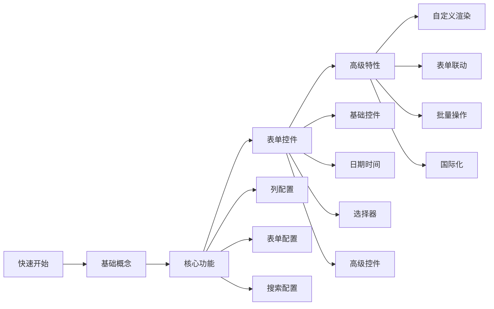

# 介绍

`@uozi-admin/curd` 是一个专为 Vue 3 + TypeScript 项目设计的企业级 CRUD 组件库。它基于 Ant Design Vue，为后台管理系统提供了一套完整、高效的数据管理解决方案。

## ✨ 核心特性

### 🚀 开箱即用
仅需几行代码，即可创建功能完整的数据管理页面，包含列表、搜索、新增、编辑、删除等全部功能。

### 🎯 统一配置
通过单一的列配置对象，同时定义表格列、搜索字段和表单字段，避免重复配置。

### 🔧 高度定制
支持自定义渲染、表单控件、验证规则、联动逻辑等，满足复杂业务需求。

### 📱 响应式设计
内置响应式布局，自动适配不同屏幕尺寸，提供优秀的移动端体验。

### 🌍 国际化支持
内置中英文语言包，支持自定义多语言配置。

## 💡 设计理念

### 约定优于配置
采用合理的默认配置，减少样板代码，让开发者专注于业务逻辑。

### 渐进增强
从最简单的表格开始，逐步添加搜索、表单、自定义渲染等功能，学习成本低。

### 类型安全
全面的 TypeScript 支持，提供完整的类型提示和编译时检查。

## 🏗️ 架构优势

### 组件化设计
可以单独使用 `StdTable`、`StdForm`、`StdSearch` 等组件，也可以使用 `StdCurd` 一站式解决方案。

### 数据驱动
通过配置对象描述数据结构和行为，而不是编写大量的模板代码。

### 插件化扩展
支持自定义表单控件、渲染器、验证器等，轻松扩展功能。

## 🎯 适用场景

- **后台管理系统** - 用户管理、权限配置、数据监控等
- **内容管理系统** - 文章管理、分类管理、标签管理等  
- **电商管理后台** - 商品管理、订单管理、会员管理等
- **业务系统** - 客户管理、项目管理、财务管理等

## 🚀 快速体验

只需要几行代码，就能创建一个完整的用户管理页面：

```vue
<template>
  <StdCurd
    title="用户管理"
    :api="userApi"
    :columns="columns"
  />
</template>

<script setup lang="ts">
import { StdCurd } from '@uozi-admin/curd'
import { useCurdApi } from '@uozi-admin/request'

const userApi = useCurdApi('/users')
const columns = [
  {
    title: '用户名',
    dataIndex: 'username',
    search: { control: 'input' },
    form: { control: 'input', required: true }
  },
  {
    title: '邮箱', 
    dataIndex: 'email',
    form: { control: 'input', required: true }
  }
]
</script>
```

这样就完成了一个功能完整的用户管理页面！

## 📚 学习路径




准备好开始了吗？让我们从 [快速开始](/zh/curd/quick-start) 开始吧！
