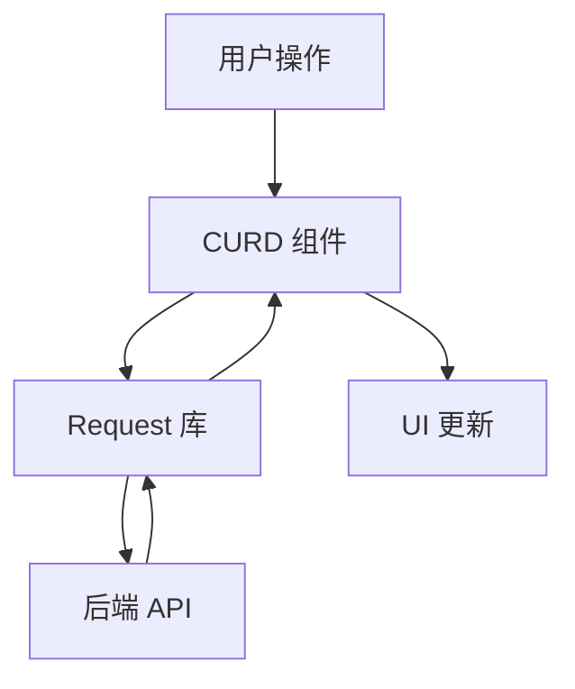

# UOZI Admin 框架总览

UOZI Admin 是一个现代化的 Vue 3 后台管理系统开发框架，提供了完整的开发工具链和组件库，让你能够快速构建功能丰富的后台管理系统。

## 🎯 核心理念

**约定优于配置** - 通过合理的默认配置和约定，减少重复的配置工作

**组件化开发** - 提供丰富的组件库，支持高度自定义

**类型安全** - 完整的 TypeScript 支持，提供更好的开发体验

**开箱即用** - 一键创建项目，内置最佳实践

## 📦 核心包介绍

### 🛠️ 开发工具

#### `create-uozi-admin`
**项目脚手架工具**
- 一键创建新项目
- 内置最佳实践配置
- 交互式项目配置

```bash
pnpm create uozi-admin@latest
```

#### `@uozi-admin/shared-config`
**共享配置包**
- 统一的 Vite 配置
- 常用插件预配置
- 开发环境优化

### 🎨 UI 组件

#### `@uozi-admin/layout-antdv`
**布局组件库**
- 完整的后台布局方案
- 响应式设计
- 主题定制支持
- 导航菜单管理

#### `@uozi-admin/curd`
**CRUD 组件库**
- 数据表格组件
- 表单组件
- 搜索组件
- 分页组件
- 丰富的表单控件

### 🌐 数据层

#### `@uozi-admin/request`
**HTTP 请求库**
- 基于 Axios 封装
- 自动生成 CRUD 接口
- 请求/响应拦截器
- 完整的类型支持

## 🚀 快速开始

### 1. 创建项目

```bash
# 使用脚手架创建新项目
pnpm create uozi-admin@latest my-admin
cd my-admin
pnpm install
pnpm run dev
```

### 2. 项目结构

```
my-admin/
├── src/
│   ├── api/          # API 接口定义
│   ├── views/        # 页面组件
│   ├── router/       # 路由配置
│   ├── store/        # 状态管理
│   └── main.ts       # 应用入口
├── public/           # 静态资源
└── package.json
```

### 3. 核心概念

#### API 层
使用 `@uozi-admin/request` 定义接口：

```ts
// src/api/user.ts
import { useCurdApi } from '@uozi-admin/request'

export const userApi = useCurdApi('/users')
```

#### 页面组件
使用 `@uozi-admin/curd` 快速构建页面：

```vue
<!-- src/views/user/index.vue -->
<script setup lang="ts">
import { userApi } from '~/api/user'
import { StdCurd } from '@uozi-admin/curd'
import { columns } from './columns'
</script>

<template>
  <StdCurd
    title="用户管理"
    :api="userApi"
    :columns="columns"
  />
</template>
```

#### 列定义
定义表格列和表单字段：

```ts
// src/views/user/columns.ts
import type { StdTableColumn } from '@uozi-admin/curd'

export const columns: StdTableColumn[] = [
  {
    title: '用户名',
    dataIndex: 'username',
    search: { type: 'input' },
    edit: { 
      type: 'input', 
      formItem: { required: true }
    }
  },
  {
    title: '邮箱',
    dataIndex: 'email',
    edit: { 
      type: 'input',
      formItem: { required: true }
    }
  }
]
```

## 📚 学习路径

### 🌟 新手入门
1. [CLI 工具](/zh/cli/quick-start) - 创建第一个项目
2. [Request 库](/zh/request/quick-start) - 了解 API 层
3. [CURD 组件](/zh/curd/quick-start) - 构建第一个页面

### 🔧 进阶使用
1. [布局组件](/zh/layout/quick-start) - 自定义布局
2. [表单控件](/zh/curd/form-controls/basic-controls) - 丰富的表单组件
3. [自定义渲染](/zh/curd/advance/customization) - 高级定制

## 🔄 数据流



1. **用户操作** - 在 CURD 组件中进行增删改查操作
2. **CURD 组件** - 处理用户交互，调用 API
3. **Request 库** - 发送 HTTP 请求到后端
4. **后端 API** - 处理业务逻辑，返回数据
5. **UI 更新** - 根据返回数据更新界面

## 🎨 架构特点

### 分层架构
- **表现层** - Layout + CURD 组件
- **数据层** - Request 库
- **配置层** - Shared Config

### 插件化设计
- 每个包都可以独立使用
- 通过配置进行集成
- 支持渐进式采用

### 类型安全
- 完整的 TypeScript 支持
- 接口类型自动推导
- 编译时错误检查

## 🤝 生态系统

- **Vue 3** - 现代化的前端框架
- **Ant Design Vue** - 企业级 UI 组件库
- **Vite** - 快速的构建工具
- **TypeScript** - 类型安全的 JavaScript
- **UnoCSS** - 原子化 CSS 引擎

## 📖 下一步

- 🚀 [开始创建项目](/zh/cli/quick-start)
- 📚 [了解核心概念](/zh/curd/fundamentals/concepts)